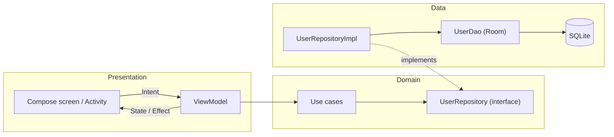
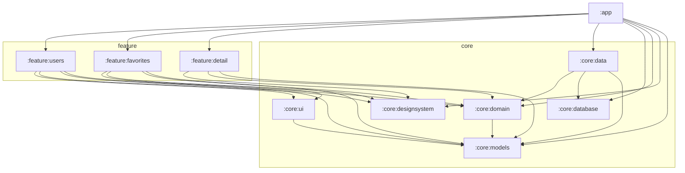

# Telynet Users

An Android app for field teams to browse a directory of users, track which ones have been visited, and keep a list of favorites. It is built as a multi-module Clean Architecture project that mixes **Java** (domain, data, database and a View-based screen) with **Kotlin + Jetpack Compose** (presentation).

## Features

- **User list:** paged list of users (20 per page) with search by name, a visit filter (All / Visited / Pending, with counts) and sorting by name or code, ascending or descending.
- **Quick actions:** call a user or open directions to their address in Google Maps from the list.
- **Favorites:** mark users with a heart; the Favorites tab shows them in a paged list and updates as soon as one is added or removed.
- **User detail:** XML/View-based screen with photo, visit status, address, company, phone and email.
- **Bottom navigation** between Users and Favorites using Navigation 3.
- **Material 3 theming** shared by Compose and XML screens, with dark mode and dynamic color on Android 12+.
- **Sample data:** 200 fake users are generated the first time the database is created.

## Languages

| Language | Where it is used |
| --- | --- |
| **Java** | Domain (use cases, repository contracts), data (repository implementation, DI), database (Room entities, DAO), models, and the `feature:detail` View-based screen |
| **Kotlin** | App shell and navigation, Compose UI, ViewModels and MVI contracts in `feature:users` and `feature:favorites`, the design system |
| **XML** | Layouts, colors and the View-based Material 3 theme |

## Tech stack

| Area | Library | Version |
| --- | --- | --- |
| Build | Android Gradle Plugin | 9.4.1 |
| | Gradle | 9.7.1 |
| | Kotlin | 2.4.20 |
| | KSP | 2.3.12 |
| UI (Compose) | Compose BOM, Material 3 | 2026.09.00 |
| | Material Icons (core / extended) | from BOM |
| UI (Views) | Material Components | 1.14.0 |
| | AppCompat | 1.8.0 |
| | ConstraintLayout | 2.2.2 |
| Navigation | Navigation 3 (runtime, ui) | 1.1.7 |
| | Lifecycle ViewModel Navigation 3 | 2.11.0 |
| Dependency injection | Hilt | 2.60.1 |
| | Hilt Navigation Compose | 1.4.0 |
| Persistence | Room (runtime, RxJava 3, Paging) | 2.8.5 |
| Paging | Paging 3 (common, RxJava 3, Compose) | 3.5.1 |
| Reactive / async | RxJava 3 / RxAndroid | 3.1.12 / 3.0.2 |
| | Kotlin Coroutines (reactive, rx3) | 1.11.0 |
| Lifecycle | Lifecycle runtime / ViewModel / LiveData | 2.11.0 |
| Images | Coil (Compose and View) | 2.7.0 |
| Serialization | kotlinx.serialization (navigation keys) | 1.11.0 |

All versions are declared in the version catalog at [`gradle/libs.versions.toml`](gradle/libs.versions.toml).

## Architecture

The app follows **Clean Architecture** with three layers, and **MVI** in the Compose presentation layer.



### Layers

- **Domain (`core:domain`):** pure business rules. `UserRepository` defines the contract and the use cases (`GetUsersUseCase`, `GetFavoritesUseCase`, `GetUserByCodeUseCase`, `ToggleFavoriteUseCase`, `SaveUserUseCase`, `DeleteUserUseCase`) expose one operation each. It depends only on `core:models`.
- **Data (`core:data`, `core:database`):** `UserRepositoryImpl` implements the domain contract on top of Room, maps `UserEntity` to the `User` model, and builds the `Pager`s. Hilt binds the implementation to the interface in `DataModule`, and `DatabaseModule` provides the database and DAO.
- **Presentation (`feature:*`, `app`):** ViewModels call use cases and expose state to Compose or XML screens.

### MVI in the Compose features

Each Compose screen has a small contract:

| Piece | Users | Favorites | Purpose |
| --- | --- | --- | --- |
| **State** | `UserListUiState` (data class) | - | Immutable screen state: search, filter, sort, counts |
| **Intent** | `UserListIntent` (sealed) | `FavoritesIntent` (sealed) | Everything the user can do |
| **Effect** | `UserListEffect` (sealed) | `FavoritesEffect` (sealed) | One-time events, such as snackbar messages |

- The screen sends intents to `ViewModel.onIntent()`.
- State-changing intents go through a pure `reduce(state, intent)` function; side effects such as toggling a favorite run in coroutines.
- The paged list is exposed as a separate `Flow<PagingData<User>>`. In the users screen it is **derived from the state**: a new search, filter or sort starts a new pager (`distinctUntilChanged` + `flatMapLatest`), while count updates don't.
- Effects are delivered through a `Channel` and collected with the shared `ObserveAsEvents` helper only while the screen is started.
- The Favorites screen has no separate state class, because its only data is the paged list, whose load states already cover loading, errors and the empty case.

The View-based `feature:detail` uses a Java `ViewModel` with `LiveData` and a sealed `UserDetailUiState` (`Loading`, `Success`, `NotFound`, `Error`).

### Data flow and paging

1. `UserDao` returns a Room `PagingSource` for the filtered users and the favorites.
2. `UserRepositoryImpl` wraps it in a `Pager` (page size 20) and exposes `Flowable<PagingData<User>>` through `paging-rxjava3`, mapping each entity to a model.
3. The Kotlin ViewModels convert the stream into a `Flow` (`kotlinx-coroutines-reactive`) and `cachedIn(viewModelScope)` so pages survive configuration changes.
4. Compose collects it with `collectAsLazyPagingItems()` and renders it in the shared `PagedUserList`, which handles the first load, errors with retry, the empty state and the "loading more" footer.

Room invalidates the `PagingSource` whenever the `users` table changes, so writes such as a favorite toggle refresh the visible page without any manual reload.

### Java and Kotlin interoperability

- The domain and data layers expose RxJava 3 types (`Flowable`, `Maybe`, `Completable`). The Kotlin ViewModels bridge them to coroutines with `asFlow()` and `await()`.
- Room is configured with `room.generateKotlin=false` so the generated DAO code is Java. The Kotlin code generator treats the Java DAO's generic types as nullable, which `PagingSource` and `Maybe` reject.

## Modularization



| Module | Language | Responsibility |
| --- | --- | --- |
| `:app` | Kotlin | Application class, `MainActivity`, Navigation 3 back stack and bottom bar; wires features together |
| `:feature:users` | Kotlin (Compose) | User list screen: search bar, quick filters, sort menu, MVI ViewModel |
| `:feature:favorites` | Kotlin (Compose) | Favorites screen with MVI ViewModel |
| `:feature:detail` | Java + XML | `UserDetailActivity`, its ViewModel and layouts |
| `:core:ui` | Kotlin (Compose) | Shared components: `UserListItemCard`, `PagedUserList`, `UserAvatar`, `VisitStatusBadge`, `ObserveAsEvents`, dialer and maps intents |
| `:core:designsystem` | Kotlin + XML | `TelynetUsersTheme` for Compose and its XML twin `Theme.TelynetUsers.Views` |
| `:core:domain` | Java | Repository contract and use cases |
| `:core:data` | Java | Repository implementation, paging setup, Hilt bindings |
| `:core:database` | Java | Room database, `UserEntity`, `UserDao`, fake data generator |
| `:core:models` | Java | Shared `User` model |
| `:core:common` | - | Placeholder for shared utilities (currently empty) |

**Rules the graph follows:**

- Features never depend on each other; `:app` is the only module that knows all of them and connects them through navigation.
- Features depend on `:core:domain`, never on `:core:data` or `:core:database`, so they can't reach Room directly.
- `:core:domain` depends only on `:core:models`.

## Requirements

- Android Studio with support for AGP 9.4
- JDK 17 or newer to run Gradle (modules compile to Java 11 bytecode)
- `minSdk` 24, `targetSdk` / `compileSdk` 37

## Build and run

```bash
./gradlew :app:assembleDebug   # build the debug APK
./gradlew :app:installDebug    # install on a connected device or emulator
```

Or open the project in Android Studio and run the `app` configuration.

## Known limitations

- **No database migrations yet:** the Room database is still at `version = 1`, and the schema has changed during development (`address`, `imageUrl`, `company`, `isFavorite`). If an older build is installed, clear the app's data or uninstall it before running a new one.
- **Chip counts read the whole table:** the visit filter counts come from loading every user; a `COUNT(*)` query would avoid that.
- **Detail screen actions:** the call, directions and copy buttons on the detail screen are not wired up yet.
